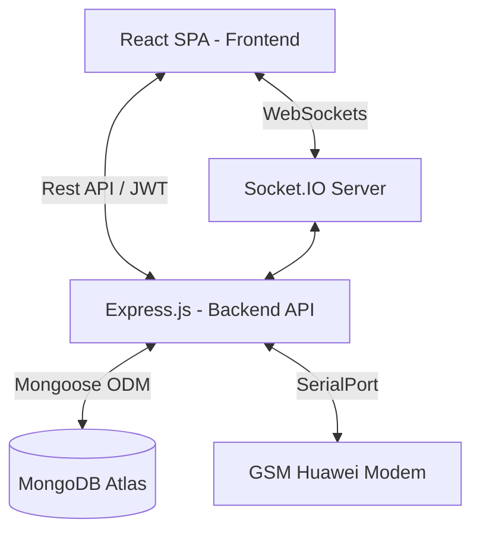

# CRM Project: System Design Document

This document outlines the detailed technical architecture and design patterns used in the CRM system.

---

## 1. High-Level Architecture Overview
The system follows a **Decoupled Monolith** architecture based on the **MERN Stack** (MongoDB, Express, React, Node.js).

---

## 2. Frontend Design (Client-Side)
Building using **React** with a modular component-based structure.

-   **State Management**: **Redux Toolkit** (Slices) handles global states like `auth` and `users`.
-   **Routing**: **React Router DOM** with protected route guards (RBAC).
-   **Real-time Integration**: Centralized `SocketContext` facilitates live chat updates and location tracking across components.
-   **API Layer**: Services are abstracted into a common fetch utility with automatic 401 (unauthorized) handling.

---

## 3. Backend Design (Server-Side)
A modular **Express.js** application organized by concern.

-   **Routing Layer**: Organized by resource (`/api/leads`, `/api/appointments`, etc.).
-   **Middleware Chain**:
    1.  **Security**: Helmet (Headers), CORS.
    2.  **Rate Limiting**: Buffer against brute-force (Memory-based).
    3.  **Authentication**: JWT extraction and validation.
    4.  **Authorization**: Role-based access checks (Admin vs. BDM).
-   **Service Layer**: Business logic (e.g., `attendanceService`, `modemService`) is separated from the controller to ensure reusability (used by both REST and Socket.io).
-   **Hardware Layer**: The `modem.js` service uses **Node SerialPort** to communicate with physical GSM hardware via AT commands.

---

## 4. Real-time & Event-Driven Design
Leverages **Socket.IO** for low-latency features.

-   **Chat System**: 
    -   Users join specific rooms: `user_{userId}`.
    -   Messages are saved to MongoDB (Persistence) then emitted to the recipient's room (Real-time).
-   **Tracking System**:
    -   BDMs emit `locationUpdate` events.
    -   Watchers (Admins) join a session room to receive live geolocation streams.
-   **Hardware Events**: Modem status and incoming call events are broadcasted to all connected admin clients via the `modemStatus` event.

---

## 5. Security Model
-   **Identity**: Stateless **JWT (JSON Web Tokens)** stored in HttpOnly cookies/local state.
-   **Access Control**: 
    -   `admin`: Full CRUD access and system reports.
    -   `telecaller`: Can manage leads and appointments.
    -   `bdm`: View-only or restricted to assigned leads/location tracking.
-   **Data Safety**: Mongoose schema validation and Sanitization (XSS) at the API entry points.

---

## 7. Scalability: CDN & Load Balancing Strategy

This project is designed to scale from a single-server setup to a high-availability distributed system.

### A. CDN Caching (Edge Strategy)
- **Frontend Assets**: The React build (Vite) generates unique hashes for all JS/CSS files. These are ideal for **Infinite Caching** on a CDN (like Vercel Edge, Cloudflare, or AWS CloudFront).
- **Static Assets**: User-uploaded lead files and avatars are served via a static path. In a scaled environment, these should be moved to **Object Storage (AWS S3)** and cached via CDN to reduce server bandwidth.
- **API Caching**: Since CRM data is highly dynamic, we avoid CDN caching for `/api` routes to prevent "stale" data (e.g., showing a lead that was just deleted).

### B. Load Balancing (Horizontal Scaling)
- **Application Layer**: To handle high traffic, multiple instances of the Express backend can be run behind a **Load Balancer** (Nginx or AWS ELB) using a **Round Robin** strategy.
- **The "Real-time" Challenge**: Because we use Socket.io, horizontal scaling requires two specific configurations:
    1. **Sticky Sessions**: The Load Balancer must ensure a specific user stays connected to the same server instance for the duration of their session.
    2. **Shared State**: To sync events across different servers, a shared pub/sub layer (like **Redis**) would need to be re-introduced. Without it, real-time consistency is lost across instances.

---

## 9. Production Orchestration & Observability

The "Enterprise" features added ensure the system is ready for high-reliability production.

### A. Process Management (PM2)
- **Role**: In production, the system is managed by `ecosystem.config.js`.PM2 ensures the app is **Self-Healing** (restarts if it crashes) and handles zero-downtime reloads.
- **Clustering**: It leverages all available server cores, allowing the app to handle significantly higher concurrent loads.

### B. Observability (Winston & Morgan)
- **Strategy**: Logs are routed to the `logs/` directory with daily rotation to prevent storage overflow.
- **Error Tracking**: In a professional setup, these log files should be hooked into a log aggregator (like Papertrail, Grafana, or CloudWatch) to track server health in real-time.

### C. Database Performance (Mongoose Indexes)
- **Sustainability**: The indexes are strictly defined in the code-level Schemas. No matter where the database is hosted (MongoDB Atlas or self-hosted), these performance boosters remain active.

---

## 10. Implementation of Performance Fallbacks
Recognizing that local environments vary, the system is built with **Resilient Defaults**:
-   **No Cache**: If an external cache (Redis) is missing, the system defaults to direct database queries to prevent failure.
-   **Hardware**: The modem service uses a silent background retry pattern so the backend stays functional even if no USB hardware is present.
